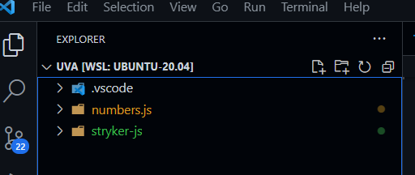
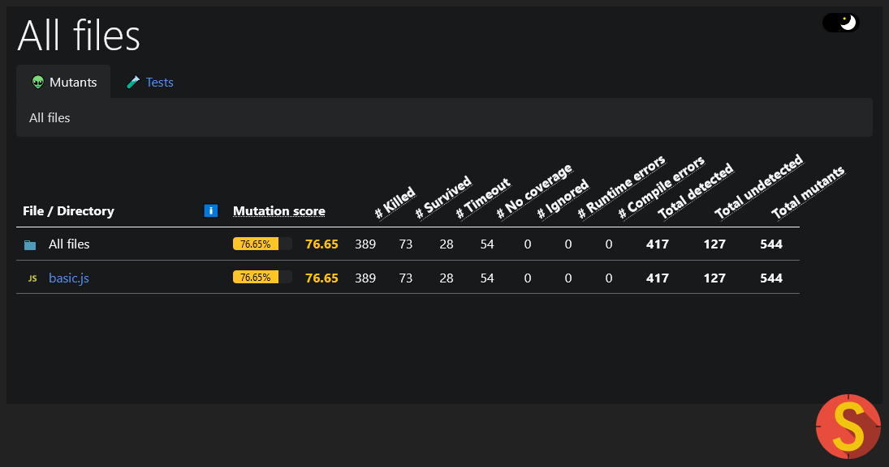
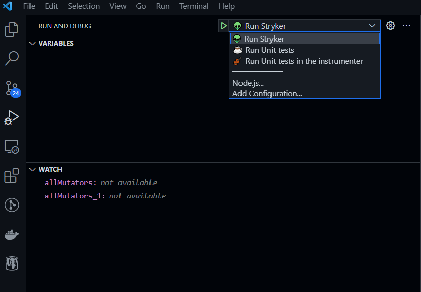
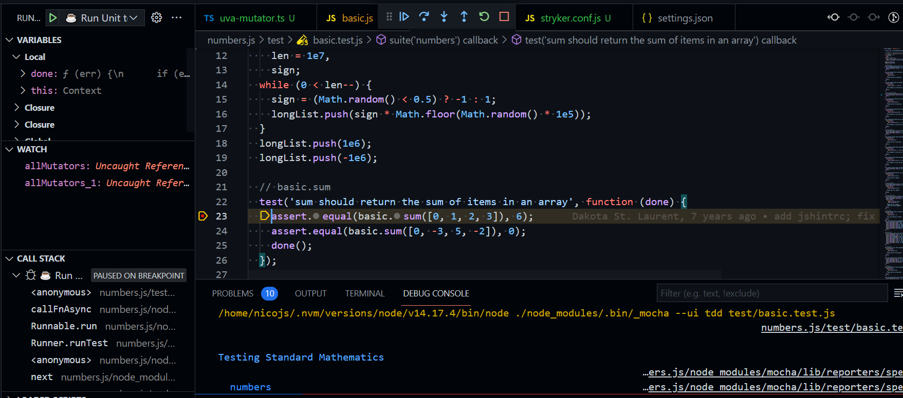
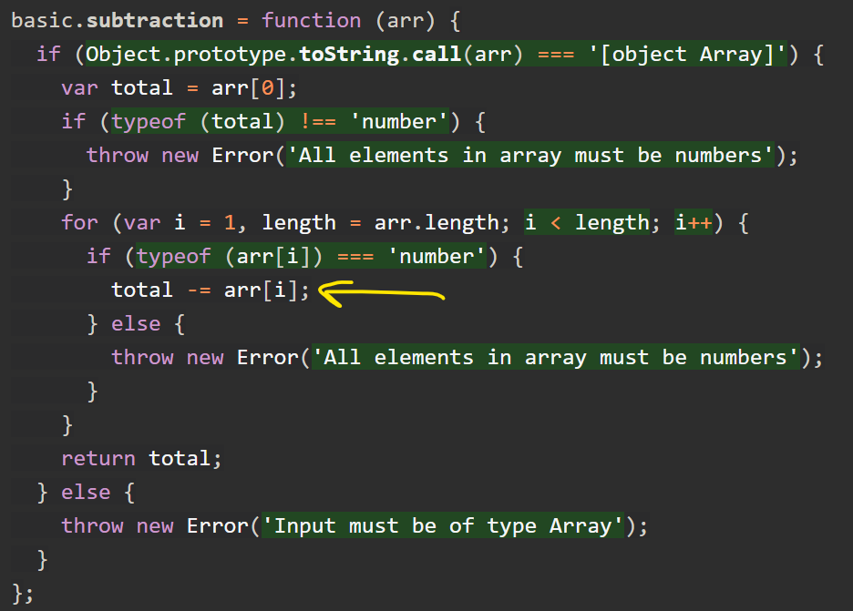

# Mutation testing with StrykerJS

– LABORATORY –

---

## Introduction

In this laboratory, you will carry out some practical exercises with a state-of-the-art Mutation testing tool: StrykerJS. StrykerJS is the industry leading mutation testing tool for JavaScript and TypeScript, developed in open source and maintained by Info Support.

The code base you will be working on is [numbers.js](https://github.com/numbers/numbers.js), a JavaScript library to perform math operations, it has simple functions like `sum` and `max`, but also an implementation for complex numbers, matrix calculus, etc. Running StrykerJS on the 'basic.js' file yields a mutation score of 76.29%.

To become familiar with StrykerJS, you will first do an introductory exercise where we improve the mutation score. This will give you some hands-on experience with unit testing in JavaScript. Afterwards, you will be challenged to enhance StrykerJS with your very own mutator. Good luck!

---

## 1. Numbers.js

### 1.1. Setup and run StrykerJS

During this exercise you will play around with the code base. You will learn the basics of compiling StrykerJS and running it on the `basic.js` file in numbers.js.

To get started, be sure you have [vscode](https://code.visualstudio.com/) and [nodejs v12 or higher installed](https://nodejs.org/en/). 

```sh
$ node -v
v14.17.4
```

Also make sure to have bash (linux shell) or git-bash (windows) installed. 

Next, unzip the "assignment.zip" file on your hard disk and open visual studio code in the root directory.



Now to install the dependencies, `cd` into "numbers.js" and perform `npm install`. After that, do the same for  "stryker-js".

```sh
$ cd numbers.js
$ npm install
$ cd ../stryker-js
$ npm install
```

You should be able to start the StrykerJS TypeScript compiler in watch mode by pressing `CTRL+shift+B`. Alternatively, you can use `F1` and select "Tasks: Run Build Task".


Now wait for StrykerJS to be compiled for the first time. 


The build command task will remain running after the first compilation. Any changes you make will be recompiled on the fly.

After StrykerJS is compiled, it is time for your first StrykerJS run. You can execute `run-stryker.sh` from inside the "numbers.js" directory.

```sh
cd numbers.js
./run-stryker.sh
```

Running Stryker this way should take about 2,5 minutes:


When Stryker is done, you can open up the HTML report in your browser. The file is located here: "numbers.js/reports/mutation/html/index.html".



---

### 1.2. Exploring the environment

In this exercise, you will will play around with numbers.js and stryker-js in order to familiarize yourself with the development environment and the code bases.

1. Open up "numbers.js/lib/numbers/basic.js". This is the JavaScript file containing the basic math operations we'll be focussing on. You can find operations like `product`, `max` and `gcd` here.
1. Open up "numbers.js/test/basic.test.js". This file contains the unit tests for "basic.js". You can see `test` declarations here, like `test('sum should return the sum of items in an array', function (done) {})`. You can run the unit tests using the "Run and Debug" pane and running the "☕ Run Unit tests" task
1. Open up the "stryker-js/packages/instrumenter/src/mutators" directory. Here, you'll find all mutators that StrykerJS supports out of the box. Open a few of them to familiarize yourselves with the syntax. One of the simplest is "boolean-literal-mutator.ts". 
1. Notice that each mutator has a `name` (string) and a `*mutate(path)` (method). Each `mutate` implementation follows this pattern: 
    1. Test to see if the AST node supports the mutation.
    2. If so, yield one or more mutations, but never change the AST node directly.
1. You can see an empty mutator called "uva-mutator.ts", this is where you can add a custom mutator yourselves.

Further more, there are 3 run tasks prepared:
* 👽 Run Stryker
* ☕ Run Unit tests
* 🎻 Run Unit tests in the instrumenter.



These tasks can help you by allowing you to debug the code. For example, if you want to debug a unit tests in math.js, you can debug "☕ Run Unit tests" while activating a break point in your code.



If you want to debug a mutator, you can add a breakpoint in the TypeScript file of the mutator and debug "👽 Run Stryker".

Last but not least: you can focus StrykerJS to only mutate specific lines of in a file using `./run-stryker.sh -m file.js:from-to`. For example: `./run-stryker.sh -m lib/numbers/basic.js:60-65` will only mutation test lines 60 through 65 (6 lines in total). This is generally much faster than running StrykerJS on the entire file.


--- 

### 1.3. Improve mutation score

Improve mutation score of the `numbersEqual` function. The tests should pass when no mutants are active, but should kill the mutant(s) in this function.


---

### 1.4. Design a custom mutator

When you zoom in on the `subtraction` function, you can see that line 61 is green. If we look closely you can see that, in fact, no mutant was active on this line. Is this line well tested? 

Design a mutator that proofs that this line of code isn't well tested. Test out your mutator by manually inserting the mutant into the code yourself and running the tests. Do the tests still pass?

Write down a short report where you explain what mutator is needed and why it isn't well tested.



---

### 1.5. Implement the mutator

Implement the mutator designed in exercise 4 mutator. A empty mutator is prepared for just this occasion: "uva-mutator.ts". Make sure TypeScript compiler is running in watch mode.

Test that your mutator works by executing StrykerJS on the basic.js file. There should be a surviving mutant on line 61.

Now that we see the mutant survives, it is time to kill it. Add a test or change one of the existing tests.

---

## 2. Report

Write a short report in which you reflect on your experience with mutation testing. The following questions can get you started.
* How does the mutation testing relate to unit testing and test unit test coverage? What are the strengths and weaknesses of each?
* Summarize the promised benefits of mutation testing. Based on your experiences in this laboratory, do they hold up in practice?
* What disadvantages and limitations do you see in mutation testing? Do you see threats?
* How does mutation testing complement other testing approaches? In what situations would you apply mutation testing and when would you not use mutation testing?

You can include or append your final mutation report (html file). 

---

# 3. Grading
Grading will be done as follows.
* (1.5 points) Improving mutation score: we will grade the way you've improved the mutation score of `numbersEqual` 
* (1.5 points) Design a custom mutator: we will grade your design of the custom mutator and your explanation as to why it is needed.
* (3 points) Implement the mutator: we will grade your implementation of the custom mutator and test based on functionality and code review.
* (4 points) Reflection and Report: we will grade your understanding and reflection on mutation testing presented in the report.

⏳ Submission deadline: 📅 October 19 ⌚ 23:59